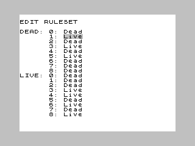

# GameOfLife

A cellular automaton simulator for the ZX Spectrum, written in Z80 assembly language.

## Build Dependencies:

- My fork of ZX BASIC SDK (for zxbasm): The assembler used to build the program: https://github.com/louishobson/zxbasic
- ZMakeBas: Make tape files from basic code: https://github.com/z00m128/zmakebas/
- FUSE Emulator Utils (for tape2wav and tapeconv): To interface with TZX files: https://sourceforge.net/projects/fuse-emulator/

## Runtime Dependencies:

- FUSE Emulator: Emulates the zx spectrum: https://sourceforge.net/projects/fuse-emulator/
- ...Or a real ZX Spectrum and tape player!

## Build:

To prepare build folders:
```
make prepare
```

To make all files, use:
```
make
```

To run using FUSE Emulator:
```
make run
```

To play the WAV file generated, use:
```
make play
```

To clean all build files:
```
make clean
```

## Prebuilt Tapes:

Prebuilt `.tzx` tapes can be found in the `tzx/` directory, and their `.wav` equivalents are found in `wav/`.

## How to use:

See the Wikipedia page on cellular automatons for an explanation of the principals: https://en.wikipedia.org/wiki/Cellular_automaton.
In particular, this implementation uses the Moore neighbourhood: https://en.wikipedia.org/wiki/Moore_neighborhood.

The program self-runs by running `LOAD ""` on the spectrum, then starting the tape.

If using the FUSE Emulator, call:
```
make run
```

which invokes:
```
fuse --no-sound tzx/GameOfLife.tzx
```

Alternatively, open FUSE and navigate to `File > Open`, then select the `.tzx` `.tzx` file manually.

There are three menus, and the edit rules menu opens on execution:

### Edit Rules Menu:

Here you can modify the rules, that govern the calculation of the next generation. For every combination of a cell being currently alive or dead, and having
none to eight neighbours, you can specify whether the cell will be alive or dead in the next generation.

Controls:

- **E**: Swap to world edit mode.
- **W**: Swap to generation mode.


- **P**: Cursor up.
- **L**: Cursor down.
- **ENTER**: Flip the setting at the current cursor position.

### Edit World Menu:

Here you can modify the aliveness of each cell individually. Dead cells appear white, and alive cells appear black. The world starts off as entirely dead.
The cursor flashes white and yellow when the cell is dead, and black and blue when the cell is alive.

Controls:

- **R**: Swap to rule edit mode.
- **W**: Swap to generation mode.
- **Numbers 1-5**: Swap to generation mode with the auto-timer active (see generation mode for details).


- **P**: Cursor up.
- **L**: Cursor down.
- **Z**: Cursor left.
- **X**: Cursor right.
- **Enter**: Swap the aliveness of the cell at the current cursor position.


- **B**: Flip the buffers (see generation mode for double buffering).
- **N**: Flip the buffers and start a new, empty world in world edit mode.

### Generation Mode:

Here you can actually iterate through generations. One notable feature is double buffering. There are two worlds stored in memory: the one currently being
read from and the one that will be written to. You can flip the buffers, by pressing **B**, to go back one generation. Also, pressing **N** to create a new,
empty world will flip the buffers before erasing the world. This means you can effectively undo by pressing **B**. 
You can also set the generations to auto-iterate at different speeds. When leaving the generation menu, the auto-timer is automatically turned off.

Controls:

- **R**: Swap to rule edit mode.
- **E**: Swap to world edit mode.


- **ENTER**: Calculates and displays the next generation.
- **Numbers 1-5**: Set the auto-timer. **1** is the fastest and **5** is the slowest.
- **T**: Turns off the auto-timer.


- **B**: Flip the buffers.
- **N**: Flip the buffers and start a new, empty world in world edit mode.

## Screenshots:

### The Edit Rules Menu:



### High-Speed Generations:

